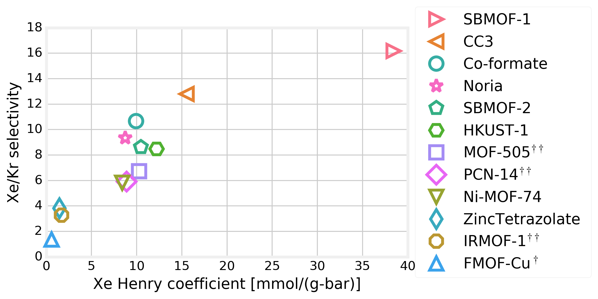

# Xe/Kr adsorption isotherm survey

This repository contains data and code used to reproduce the following plot that characterizes the performance of several MOFs and porous organic cage materials for Xe/Kr separations relevant to used nuclear fuel reprocessing. This data is used in the following articles:

D. Banerjee, C. Simon, A. Plonka, R. Motkuri, J. Liu, X. Chen, B. Smit, J. Parise, M. Haranczyk, P. Thallapally. Metal Organic Framework with Optimal Adsorption, Separation, and Selectivity towards Xenon. *Nature Communications*. (2016) *Under revision*

R. Patil, D. Banerjee, C. Simon, J. Atwood, P. Thallapally. Noria, a highly Xe-selective Nanoporous Organic Solid. (2016) Chemistry - A European Journal.

Code is in the IPython Notebook (.ipynb) file.

Xe/Kr adsorption isotherm data is in the `data` folder.

The code saves figures of resulting Henry's law fits to the adsorption isotherm data in the folder `fits`.

The code writes a LaTeX code in the `LaTeX` folder to display the results nicely.

Crystal structures are present in `xtal_structures`.
